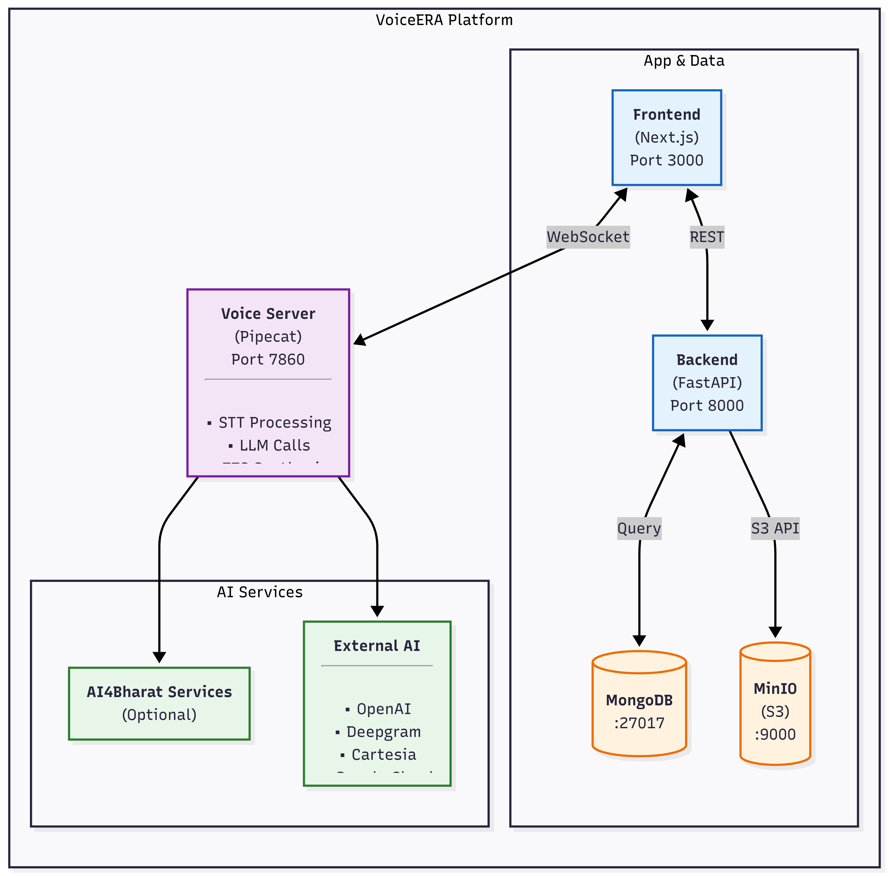
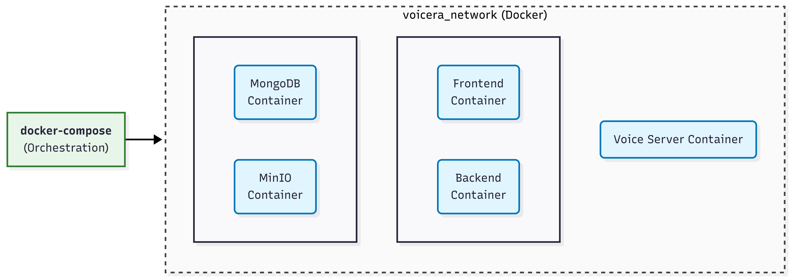

# System Architecture Overview

This document provides a high-level overview of the VoicEra system architecture using the C4 Model for system design.

## System Context (Level 1)

The "10,000-foot view" showing VoicEra's interactions with users and external systems.

### Overview


### Key Actors

- **End Users** — People making or receiving voice calls
- **Platform Operators** — Administrators managing agents and campaigns
- **AI Providers** — External or self-hosted services for LLM, STT, and TTS
- **Telephony Provider** — Vobiz platform for call handling

---

## Container Diagram (Level 2)

Zooming in to show the major technology choices and inter-service communication.

### Architecture Components



### Service Responsibilities

| Service | Technology | Responsibility |
|---------|------------|----------------|
| **Frontend** | Next.js, React, TailwindCSS | User interface, dashboards, real-time call monitoring |
| **Backend** | FastAPI, Python | API endpoints, data persistence, authentication, orchestration |
| **Voice Server** | Pipecat, Python | Real-time audio processing, agent orchestration, configurable STT/TTS/LLM integration |
| **MongoDB** | NoSQL Database | Store users, agents, campaigns, call logs, and transcripts |
| **MinIO** | Object Storage | Store audio recordings and transcript files |
| **External AI Providers** | Various APIs | Pluggable LLM, STT, and TTS backends configured per agent |

---

## Key Design Patterns

### 1. Microservices Architecture

- Independent, deployable services
- Clear separation of concerns
- Horizontal scaling capability

### 2. API-First Design

- RESTful APIs for data operations
- WebSockets for real-time communication
- Clear service boundaries

### 3. Stateless Processing

- Frontend and Backend are stateless
- Enables horizontal scaling
- Voice Server maintains session state (WebSocket connections)

### 4. Pluggable Provider Model

The Voice Server implements STT, LLM, and TTS as interchangeable provider slots. Each deployed agent specifies its preferred providers by name in a JSON configuration file. Switching providers — or running different providers for different agent types — requires no infrastructure changes.

Supported providers:

| Slot | Providers |
|------|-----------|
| **STT** | Deepgram, Google, OpenAI Whisper, Bhashini, AI4Bharat Indic |
| **TTS** | Cartesia, Deepgram Aura, Google, OpenAI, Bhashini, AI4Bharat Indic |
| **LLM** | OpenAI, Kenpath |

### 5. Data Separation

- Structured data in MongoDB
- Unstructured content (audio, files) in MinIO
- Clear data ownership per service

---

## Communication Patterns

### Synchronous Communication

```
Frontend ──REST/HTTP──► Backend ──HTTP──► MongoDB
         ◄─────────────         ◄──────────
```

### Real-Time Communication

```
Telephony (Vobiz) ──WebSocket──► Voice Server ───► AI Providers
                   ◄─────────────               ◄──
                   (Audio frames, metadata)
```

### Event-Based Processing

```
Backend ───write────► MongoDB
           (User event, call data)
             │
             ├──────► MinIO (Audio file)
             │
             └──────► Voice Server (via API)
```

---

## Data Flow at a Glance

### Voice Call Flow

```
1. User calls phone number
         ▼
2. Vobiz routes call to Voice Server
         ▼
3. Voice Server authenticates with Backend
         ▼
4. Voice Server runs the agent pipeline:
   - STT Provider:  Audio ──► Text
   - LLM Provider:  Text  ──► Response
   - TTS Provider:  Response ──► Audio
         ▼
5. Voice Server streams audio back to caller
         ▼
6. Backend logs call metadata and stores recordings
```

---

## Deployment Architecture

### Docker Containers

Each service runs in its own container:



### Volume Mounts

```
Host Machine          Docker Container
─────────────         ────────────────
./voicera_backend  ──► /app
./voicera_frontend ──► /app
./data/mongodb     ──► /data/db
./data/minio       ──► /data
```

---

## Security Layers

### Authentication and Authorization

```
User Login
   │
   ▼
Backend (JWT Token generation)
   │
   ▼
Frontend (Store JWT)
   │
   ▼
Voice Server (Validate via Backend)
   │
   ▼
Audio Processing
```

### Data Protection

- **In Transit** — TLS/HTTPS for all external API calls
- **At Rest** — Database and storage encryption
- **Access Control** — MongoDB authentication, MinIO IAM, internal API key for service-to-service calls

---

## Scalability Considerations

### Horizontal Scaling

**Stateless Services:**

- Frontend (multiple replicas behind a load balancer)
- Backend (multiple replicas with shared MongoDB)

**Stateful Services:**

- Voice Server (sticky sessions or an external session store such as Redis)
- MongoDB (replica set or sharding)

### Vertical Scaling

- Increase CPU and memory for services
- GPU acceleration for self-hosted STT/TTS model servers
- Connection pooling for databases

---

## Technology Stack Summary

| Layer | Technology | Version |
|-------|------------|---------|
| **Frontend** | Next.js | 16+ |
| | React | 18+ |
| | TailwindCSS | 4+ |
| **Backend** | FastAPI | 0.100+ |
| | Python | 3.10+ |
| | Uvicorn | Latest |
| **Voice** | Pipecat | Latest |
| | Python | 3.10+ |
| **Database** | MongoDB | 5.0+ |
| **Storage** | MinIO | Latest |
| **Infrastructure** | Docker | 20.10+ |
| | Docker Compose | 2.0+ |
| | Nginx | Latest |

---

## Next Steps

- **[System Design Details](system-design.md)** — Deep dive into each component
- **[Data Flow](data-flow.md)** — How data moves through the system
- **[Quick Start](../getting-started/quickstart.md)** — Start using VoicEra
