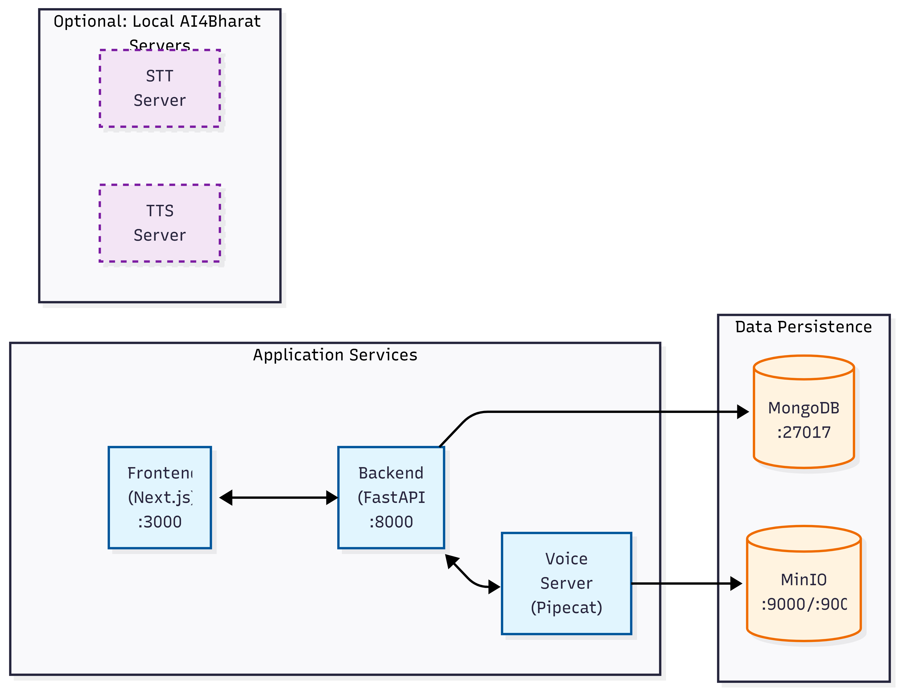

# VoicEra Documentation

Welcome to the VoicEra documentation. This is your comprehensive guide to understanding, deploying, and developing with the VoicEra platform.

## What is VoicEra?

VoicEra is a **complete voice AI platform** with telephony integration, built for deploying intelligent voice agents at scale. It provides a production-ready stack for real-time voice interactions over phone calls.

**Core capabilities:**

- **Real-time Speech-to-Text (STT)** — Transcribe caller audio using your choice of provider
- **LLM-Powered Conversational Agents** — Drive agent responses with any supported language model
- **Text-to-Speech (TTS)** — Synthesize natural-sounding agent audio with your choice of provider
- **Telephony Integration** — Handle inbound and outbound calls via the Vobiz platform
- **Swappable Provider Architecture** — STT, TTS, and LLM are configured per-agent; swap providers without changing infrastructure
- **Comprehensive Dashboard** — Manage agents, campaigns, call recordings, and analytics

## Key Features

### Multi-Provider STT and TTS

The voice pipeline treats STT and TTS as pluggable slots. Each agent specifies its own provider by name in its JSON configuration. Supported providers include Deepgram, Google, OpenAI, Cartesia, Bhashini, and AI4Bharat Indic — with no code changes required to switch between them.

### Multi-Language Support

Support for English and a broad range of Indic languages, with Bhashini and AI4Bharat Indic provider integrations for high-quality regional speech.

### Knowledge Base (RAG)

Attach PDF documents to an agent to enable retrieval-augmented generation (RAG). Chunks are embedded via OpenAI and stored in a per-organisation ChromaDB vector store. At call time the voice server retrieves the most relevant chunks and injects them into the LLM context, grounding agent answers in your content.

### Enterprise-Grade Infrastructure

- MongoDB for scalable data persistence
- MinIO for distributed object storage (recordings and transcripts)
- ChromaDB for per-organisation vector storage (knowledge base)
- JWT-based authentication and authorization
- Role-based access control with organisation isolation
- Docker and Docker Compose orchestration

## Architecture at a Glance

## Quick Navigation

### New to VoicEra?

- **[Installation](getting-started/installation.md)** — Set up your environment
- **[Quick Start](getting-started/quickstart.md)** — Get VoicEra running in minutes
- **[Configuration](getting-started/configuration.md)** — Configure services and environment

### For Developers

- **[Local Development](development/local-setup.md)** — Set up a development environment
- **[REST API](api/rest-api.md)** — REST API documentation
- **[WebSocket API](api/websocket-api.md)** — Real-time communication
- **[Contributing](development/contributing.md)** — Contribution guidelines

### For Operations and DevOps

- **[Docker Deployment](deployment/docker.md)** — Docker and Docker Compose setup
- **[Production Deployment](deployment/production.md)** — Production-grade deployment
- **[Environment Variables](deployment/environment.md)** — Configuration reference

### Understanding the System

- **[System Overview](architecture/overview.md)** — High-level architecture
- **[System Design](architecture/system-design.md)** — Detailed system design
- **[Data Flow](architecture/data-flow.md)** — How data moves through the system

## Services Overview

| Service | Port | Technology | Purpose |
|---------|------|------------|---------|
| **Frontend** | 3000 | Next.js 16 + React | Web dashboard for agent and campaign management |
| **Backend** | 8000 | FastAPI + Python | REST API, analytics, knowledge base, orchestration |
| **Voice Server** | 7860 | Pipecat + Python | Real-time voice processing and agent orchestration |
| **MongoDB** | 27017 | MongoDB | Primary data store |
| **MinIO** | 9000/9001 | MinIO | Object storage for recordings and transcripts |
| **AI4Bharat STT** | 8001 | FastAPI + PyTorch | Self-hosted Indic speech-to-text (optional) |
| **AI4Bharat TTS** | 8002 | FastAPI + PyTorch | Self-hosted Indic text-to-speech (optional) |

## Prerequisites

Before you begin, ensure you have:

- **Docker and Docker Compose** — For containerized deployment
- **Git** — For version control
- **Node.js 18+** — For frontend development (optional, Docker not required)
- **Python 3.10+** — For backend or voice server development (optional)

## Next Steps

1. **[Install VoicEra](getting-started/installation.md)** — Get your environment ready
2. **[Run Quick Start](getting-started/quickstart.md)** — Launch all services
3. **[Explore Architecture](architecture/overview.md)** — Understand the system design

## Support

- [Full Documentation](https://docs.voicera.ai)
- [Report Issues](https://github.com/voicera/voicera)
- [Discussions and Q&A](https://github.com/voicera/voicera/discussions)

---

**Version:** 1.1.0
**Last Updated:** April 2026
