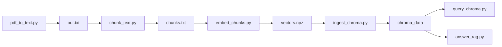

# RAG pipeline (`rag_system`)

Standalone scripts for **ingest → embed → index → retrieve → answer**. PDFs are assumed **text-based** (no OCR).

## End-to-end flow



| Stage | Script | Output / role |
|--------|--------|----------------|
| 1. Extract text | `pdf_to_text.py` | Plain text from PDF (`pypdf`) |
| 2. Chunk | `chunk_text.py` | Fixed-size overlapping character chunks |
| 3. Embed | `embed_chunks.py` | `vectors.npz` (NumPy archive) |
| 4. Index | `ingest_chroma.py` | Local **Chroma** database |
| 5a. Retrieve only | `query_chroma.py` | Top‑k similar chunks |
| 5b. Retrieve + answer | `answer_rag.py` | Chunks + **OpenAI Chat** reply |

## Dependencies (see `voicera_backend/requirements.txt`)

| Package | Used for |
|---------|-----------|
| **pypdf** | PDF text extraction |
| **openai** | Embeddings API + Chat Completions (`answer_rag.py`) |
| **numpy** | `vectors.npz` save/load |
| **chromadb** | Vector store + similarity search |
| **python-dotenv** | Loading `.env` (via `rag_env.py`) |

## Environment variables

| Variable | Purpose |
|----------|---------|
| **OPENAI_API_KEY** | Required for embedding and chat. Loaded automatically from `voice_2_voice_server/.env` at the monorepo root (if present), then process env / CWD `.env`. Implemented in **`rag_env.py`**. |

## Embedding model (OpenAI)

| Setting | Default |
|---------|---------|
| Model | **`text-embedding-3-small`** |
| Typical vector size | **1536** dimensions (unless you pass `--dimensions` on embed and query) |

**Rule:** The **same** model (and optional `--dimensions`) must be used for:

- Chunk embeddings (`embed_chunks.py`)
- Query embeddings (`query_chroma.py`, `answer_rag.py`)

Mismatch breaks retrieval quality.

## Chunking (`chunk_text.py`)

- **Character-based** sliding windows (not token-based).
- Defaults: `--chunk-size 1000`, `--overlap 200`.
- Text output uses `---` between chunks; JSON mode (`--json`) is supported for tooling.

## `vectors.npz` (intermediate file)

Produced by **`embed_chunks.py`**. Contains roughly:

| Array / key | Content |
|-------------|---------|
| **embeddings** | `float32` matrix `[num_chunks, dim]` |
| **texts** | Original chunk strings |
| **model_name** | Embedding model id used |

This file is a **portable snapshot**; **`ingest_chroma.py`** copies vectors + texts into Chroma. You can keep `vectors.npz` for backup or re-ingest without re-calling the Embeddings API.

## ChromaDB

### What we use

- **Client:** `chromadb.PersistentClient(path=<chroma_dir>)` — all data lives **on disk** under `chroma_data/` (default path next to these scripts).
- **Collection name:** **`rag_docs`** (override with `--collection`).
- **Operations used in code:**
  - **`get_or_create_collection`** — create or open the index; collection metadata includes:
    - **`hnsw:space`: `cosine`** — distance metric for search (cosine space).
    - **`embedding_dim`**, **`embedding_model`** — bookkeeping.
  - **`upsert`** — insert/update records by id (`chunk_0`, `chunk_1`, …). Each record has:
    - **ids**
    - **embeddings** (precomputed; Chroma does **not** embed for us on ingest)
    - **documents** (chunk text returned at query time)
    - **metadatas** — e.g. `chunk_index`, `embedding_model`
  - **`delete_collection`** — optional; used when **`ingest_chroma.py --reset`** runs before re-ingest.
  - **`query`** — nearest-neighbor search (see Retrieval below).

### On-disk layout

Typical files include **`chroma.sqlite3`** and HNSW segment files under a UUID folder. Treat **`chroma_data/`** as the database; add it to **`.gitignore`** (already listed under `voicera_backend/.gitignore`).

### Index / search algorithm

Chroma uses an **approximate nearest neighbor (ANN)** index (**HNSW**) with **cosine** distance, as configured via collection metadata **`hnsw:space`**. Queries are **not** full linear scans over every vector at read time in the way a naive NumPy loop would be.

## Retrieval mechanism

1. **User question** → same **OpenAI Embeddings** model as ingest → one **query vector**.
2. **`collection.query(query_embeddings=[...], n_results=k, include=[...])`**  
   Chroma returns the **k** nearest stored chunks by the configured metric (cosine).
3. **`query_chroma.py`** prints **documents**, **distances**, **metadata**.
4. **`answer_rag.py`** additionally sends those chunk texts + question to **`gpt-4o-mini`** (default) via **Chat Completions**, with a system prompt that keeps answers grounded in the excerpts.

**Latency note:** For telephony/voice, embedding + Chroma query is usually small compared to STT, LLM generation, and TTS.

## Chat model (`answer_rag.py`)

| Setting | Default |
|---------|---------|
| `--chat-model` | **`gpt-4o-mini`** |

Override for stronger models if needed. This is **separate** from the embedding model.

## Command cheat sheet

Run from `voicera_backend` with venv active; paths below assume `rag_system/` for artifacts.

```bash
# 1–2: PDF → chunks
python rag_system/pdf_to_text.py "rag_system/doc.pdf" -o rag_system/out.txt
python rag_system/chunk_text.py rag_system/out.txt -o rag_system/chunks.txt

# 3: Embed → npz
python rag_system/embed_chunks.py rag_system/chunks.txt -o rag_system/vectors.npz

# 4: Load into Chroma
python rag_system/ingest_chroma.py rag_system/vectors.npz
# Full re-index:
python rag_system/ingest_chroma.py rag_system/vectors.npz --reset

# 5a: Retrieve only
python rag_system/query_chroma.py "Your question?" -k 5

# 5b: Retrieve + LLM answer
python rag_system/answer_rag.py "Your question?"
python rag_system/answer_rag.py "Your question?" --show-context   # chunks → stderr, answer → stdout
```

## Module map

| File | Role |
|------|------|
| `rag_env.py` | `repo_root()`, `load_rag_env()` |
| `pdf_to_text.py` | PDF → text |
| `chunk_text.py` | Text → chunks |
| `embed_chunks.py` | Chunks → OpenAI embeddings → `vectors.npz` |
| `ingest_chroma.py` | `vectors.npz` → Chroma `upsert` |
| `query_chroma.py` | Embed query + Chroma `query` |
| `answer_rag.py` | Retrieval + Chat Completions (imports `embed_query` from `query_chroma.py`) |

## Privacy / data flow

- **Embeddings:** Chunk text is sent to **OpenAI** during `embed_chunks.py` and query text during search/answer.
- **Chroma:** Stores vectors and text **locally** under `chroma_data/`.

## Integrating with Voicera

Use the same sequence as **`answer_rag.py`**: after **STT** text is available, call retrieval + chat, then pass the answer string to **TTS**. Prefer importing or factoring **`retrieve_chunk_texts`** / chat logic from `answer_rag.py` rather than shelling out to the script, for lower latency and error handling.
